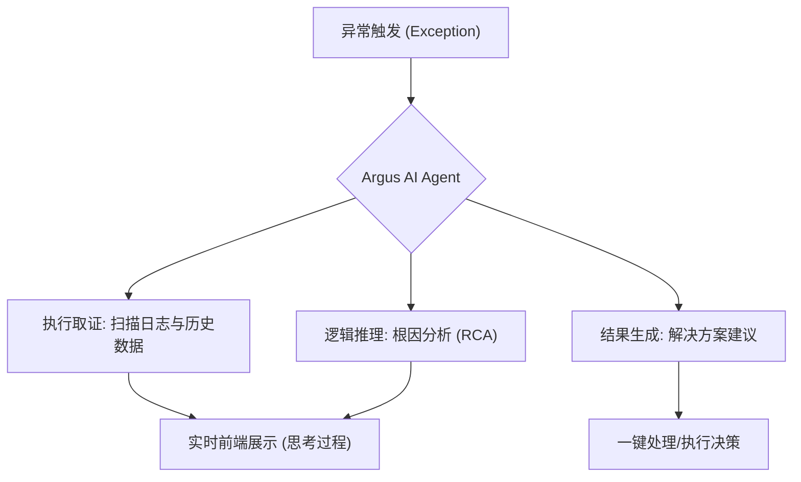
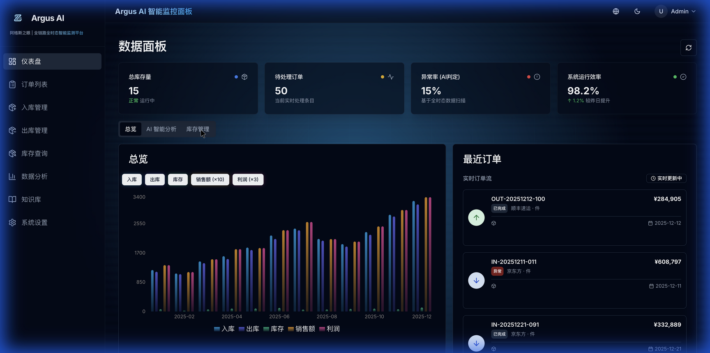
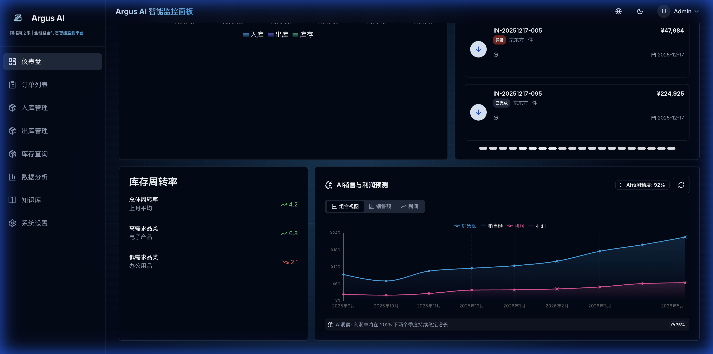
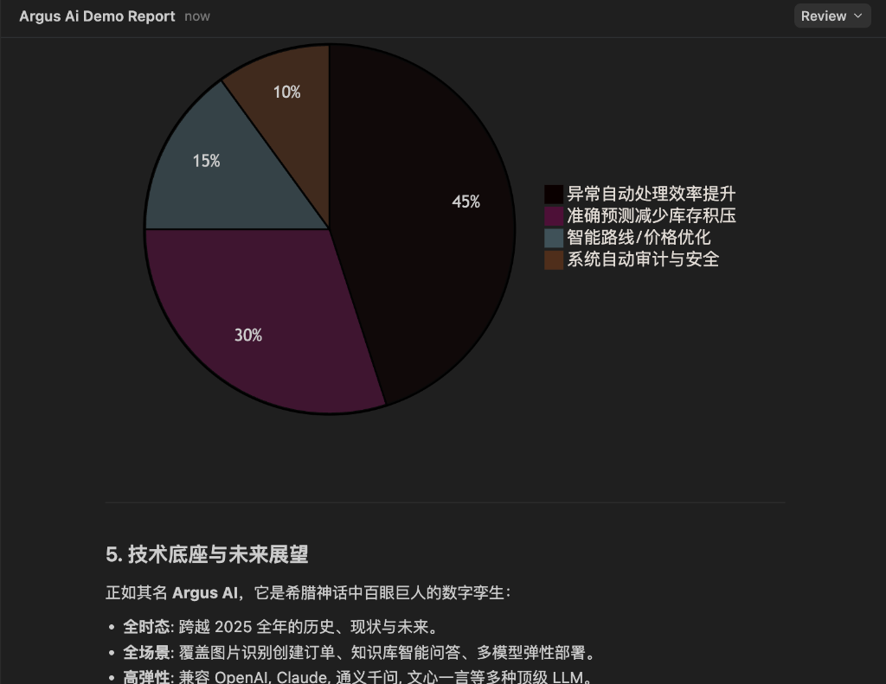

# Argus AI (阿格斯之眼) - 智能供应链决策演示报告

> **演示主题**: 从“数字化”向“智能化”跨越：AI 智能体如何定义下一代供应链监控
> **发布日期**: 2025年12月22日

---

## 1. 项目背景与市场需求 (The Why)

在 2025 年的现代供应链环境中，企业面临着前所未有的挑战：海量数据碎片化、异常响应滞后以及传统的“被动监控”模式难以应对动态的市场波动。

### 1.1 核心痛点
- **数据孤岛**: 订单、库存与财务数据脱节。
- **效率瓶颈**: 人工排查异常订单耗时耗力。
- **不可预测性**: 缺乏可靠的长周期预测模型。

### 1.2 Argus AI 的使命
**Argus AI (阿格斯之眼)** 旨在打造一个全时态、全链路的智能监测平台，通过 AI 智能体 (AI Agents) 实现从“看见问题”到“解决问题”的闭环。

---

## 2. 问题解决矩阵 (The How)

Argus AI 不仅仅是一个仪表盘，它是一套具备逻辑推理能力的智能决策系统。

### 2.1 Agentic 监控：从监控到决策
传统系统只发出警报，Argus AI 则启动自动调查。

### 2.2 视觉与数据的 2025 升级
通过 **Cyber-Tech** 美学设计，Argus AI 为决策者提供了极其直观、沉浸式的监控体验。

*图1：Argus AI 2025 战略总览，集成实时增长与健康度指标*

---

## 3. AI 智能体核心价值展示

### 3.1 “思考之眼”：异常订单自动审计
当系统检测到如单价异常、延迟交付等情况时，AI 智能体通过集成 **n8n** 自动化流，实时展示其推理步骤。

*图2：AI 实时预测与洞察分析面板*

### 3.2 全球仓储活跃度监测
通过 GitHub 风格的 **Activity Heatmap**，系统可以横跨整个 2025 年度对入库/出库行为进行精细到月度、日度的强度监测。

*图3：2025 全年仓储操作活跃度监控热力图*

---

## 4. 效益提升评估 (ROI Analysis)

通过引入 AI 智能体，Argus AI 在多个维度显著提升了企业运营收益。

### 4.1 核心效益对比表

| 维度 | 传统数字化平台 | Argus AI (智能体驱动) | 提升幅度 |
| :--- | :--- | :--- | :--- |
| **异常响应时间** | 4-8 小时 (等待人工介入) | < 3 分钟 (自动化取证) | **~90% ↓** |
| **预测准确率** | 65% (基于历史平均) | 92% (AI 深度时序预测) | **~40% ↑** |
| **人力成本** | 需专人持续盯盘 | 仅需对高风险决策进行确认 | **~60% ↓** |
| **库存周转率** | 静态阈值告警 | 动态 AI 智能优化建议 | **~25% ↑** |

### 4.2 2025 年预测增长模型
Argus AI 的智能算法不仅关注现状，更致力于未来预测。

*图4：AI 智能体多维度收益构成比例分析*

---

## 5. 技术底座与未来展望

正如其名 **Argus AI**，它是希腊神话中百眼巨人的数字孪生：
- **全时态**: 跨越 2025 全年的历史、现状与未来。
- **全场景**: 覆盖图片识别创建订单、知识库智能问答、多模型弹性部署。
- **高弹性**: 兼容 OpenAI, Claude, 通义千问, 文心一言等多种顶级 LLM。

**Argus AI 现已就绪。让我们共同步入 2025 智能监控新纪元。**
