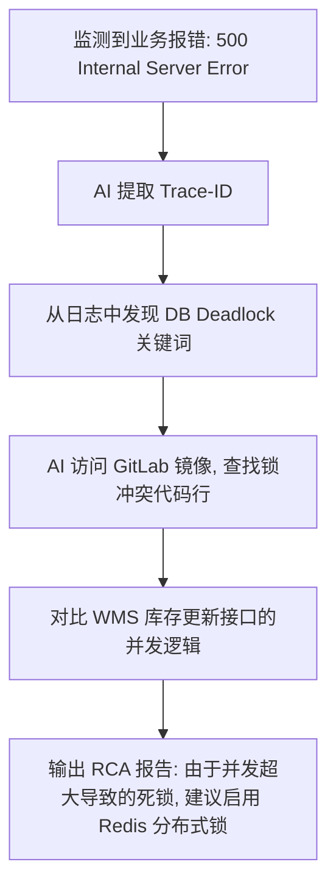

# Argus AI: 供应链异常订单智能取证与排查深度解析

## 概要

基于 [Argus_AI_Demo_Report.md](./Argus_AI_Demo_Report.md) 的预研，本文深入探讨 **Argus AI** 在真实供应链业务场景（出入库）中，如何通过 AI 智能体实现自动化上下文采集与服务器日志闭环排查。我们将传统的“人工找人、人工翻日志”模式升级为“AI Agent 自动取证、深度推理”模式。

---

## 1. 业务场景深度剖析 (Scenarios)

在供应链的“出入库”关键链路中，异常往往具有跨系统、碎片化的特点。

### 1.1 入库场景：SKU 数量/质量判定异常
*   **异常点**: 现场收货数量与采购单（PO）严重不符，或质检照片通过多模态 AI 识别发现严重破损。
*   **AI 介入**: 此时 AI 不仅仅发出通知，而是立即回溯该供应商的历史到货率，并调取 ERP 中该 SKU 的采购合同条款，判断是否触发赔付逻辑。

### 1.2 出库场景：拣货锁定（Soft Allocation）失败
*   **异常点**: 订单状态为“已支付”，但 WMS 接口返回 `Inventory insufficient`。
*   **AI 介入**: AI 立即执行“全仓库存扫描”，检查是否存在锁定未释放（Dead Stock）或多个并发订单抢占同一库位导致的死锁。

---

## 2. 自动化上下文收集 (Automated Contextual Intelligence)

AI 智能体的核心优势在于其 **“自主工具调用能力”**。当检测到 `OrderID: 12345` 异常时，Agent 会并行执行以下操作：

### 2.1 证据链拼图
1.  **ERP 快照**: 调用 `/api/v1/orders/detail` 获取该订单的原始意图、优惠券使用情况及期望交付时间。
2.  **WMS 实时状态**: 调用 `/api/v1/warehouse/stock-status` 查询该 SKU 在物理库位的实时冻结数、在途数及操作员操作流水。
3.  **TMS 物流轨迹**: 若涉及已发货，自动抓取承运商（如 SF, UPS）的最新轨迹，并判断是否由于气象等外部因素导致履约风险。

### 2.2 数据格式化
AI 将收集到的多维数据统一转化为结构化的 `Observation JSON`，作为推理流程（Reasoning Chain）的原始输入：
```json
{
  "order_status": "PENDING_STOCK",
  "inventory_actual": 0,
  "inventory_locked_by_others": 5,
  "last_worker_id": "W-058",
  "log_anomalies_detected": true
}
```

---

## 3. 服务器日志集成与关联排查 (Root Cause Isolation)

这是将业务异常映射到软件底层缺陷的关键路径。

### 3.1 Trace ID 链路追踪
Argus AI 通过接入分布式追踪（如 SkyWalking 或 Jaeger），根据 `OrderID` 关联出所有的 `Trace-ID`。

1.  **日志聚合**: 向 ELK/Sentry 发起检索命令：“Find all ERROR logs within 10 minutes associated with Trace-ID XYZ”。
2.  **智能过滤**: 使用 LLM 对冗长的 Java/Node.js Stack Trace 进行摘要，剔除无关的 `NullPointerException` 及其它环境干扰噪声。

### 3.2 深度推理排查流 (The Deep-Dive Workflow)


---

## 4. 落地建议 (Actionable Insights)

为了在真实场景下发挥 AI 的最大潜力，建议企业构建以下基础设施：

1.  **统一 API 网关**: 使 AI Agent 能够通过标准化接口访问所有孤岛系统（OpenAPI/GraphQL）。
2.  **高质量日志语义化**: 在代码中埋点时，不仅记入 ID，更有意义的是记入 **业务语义**（如：`Inventory decrement failed for User X`），这能显著提升 LLM 的理解精度。
3.  **人机协作闭环**: 初始阶段，AI 输出建议（Suggestive），由人工点击“执行修复”；成熟后，授予 AI 部分“自动修复（Auto-Remediation）权限”。

---

> [!TIP]
> **Argus AI** 的本质是将“排查专家”的经验数字化。它通过对上下文和日志的秒级扫描，将传统的“被动修复”模式转变为“主动预防”，确保每一笔订单都能在最短时间内恢复正常。
